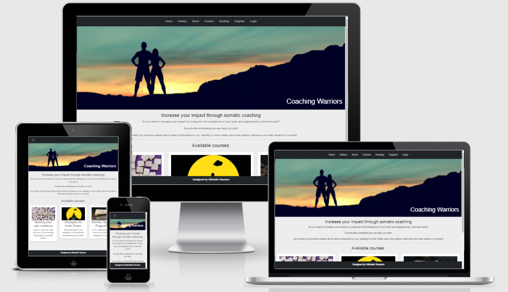
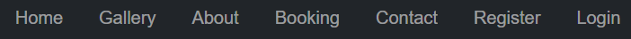
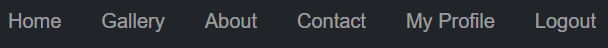
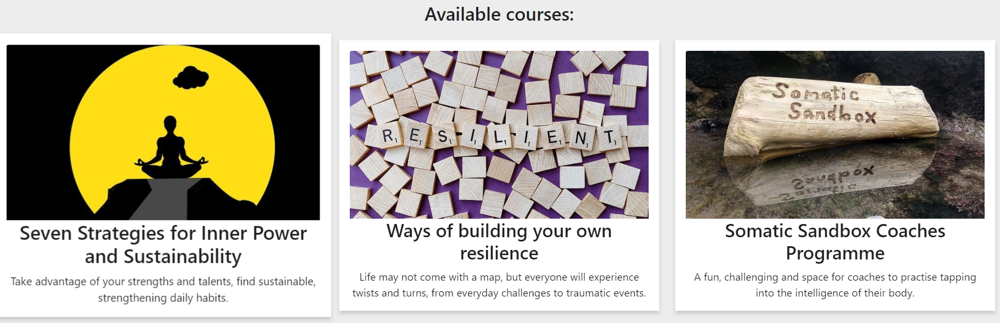

# Coaching Warriors

## Project 4 - Full Stack Toolkit

The aim of this project was to build a Full-Stack site based on business logic used to control a centrally-owned dataset.

Coaching warriors is a site designed to showcase the various courses that the coaches offer. Users can find information about the courses and coaches, and apply to attend a course.

The live site can be found <a href="https://coachingwarriors.herokuapp.com/" target="_blank" rel="noopener">here</a>. (Note: Right click on link to open a new tab).

# Table of Contents
1. [UX](https://github.com/Michelle3334/coaching-warriors#ux)
    * [Website owner goals](https://github.com/Michelle3334/coaching-warriors#website-owner-business-goals)
    * [User stories](https://github.com/Michelle3334/coaching-warriors#user-stories)
    * [Structure](https://github.com/Michelle3334/coaching-warriors#structure-of-the-website)
    * [Wireframes](https://github.com/Michelle3334/coaching-warriors#wireframes)
    * [Surface](https://github.com/Michelle3334/coaching-warriors#surface)
2. [Features](https://github.com/Michelle3334/coaching-warriors#features)
3. [Database Schema](https://github.com/Michelle3334/coaching-warriors#database-schema)
4. [Technologies Used](https://github.com/Michelle3334/coaching-warriors#technologies-used)
5. [Testing](https://github.com/Michelle3334/coaching-warriors#testing)
    * [Functionality testing](https://github.com/Michelle3334/coaching-warriors#functionality-testing)
    * [Code Validation](https://github.com/Michelle3334/coaching-warriors#code-validation)
    * [Compatibility testing](https://github.com/Michelle3334/coaching-warriors#compatibility-testing)
    * [Performance testing](https://github.com/Michelle3334/coaching-warriors#performance-testing)
    * [User stories testing](https://github.com/Michelle3334/coaching-warriors#user-stories-testing)
    * [Known bugs](https://github.com/Michelle3334/coaching-warriors#known-bugs)
6. [Deployment](https://github.com/Michelle3334/coaching-warriors#deployment)
7. [Credits](https://github.com/Michelle3334/coaching-warriors#credits)
8. [Acknowledgments](https://github.com/Michelle3334/coaching-warriors#acknowledgements)

# UX
## Website owner business goals
* I want my visitors to be able to navigate my website intuitively and easily.
* I would like the website to be interesting for visitors.
* I would like to build and maintain relationships with potential and current visitors.
* I would like to manage the information about the various courses.
* I would like to be able to add draft courses so that I can finish writing the content later.

## User Stories
### New user goals:
* I want to find information about the various courses.
* I want to read information about the coach.
* I want to register on the website.
### Returning user goals:
* I would like to get in contact with the website owner and provide comments or feedback.
* I would like to view the available courses.
* I would like to be able to register for a course.

## Structure of the website
The website is designed to be user-friendy on all device sizes.

[Back to Table of Contents](https://github.com/Michelle3334/coaching-warriors#table-of-contents)

## Wireframes
I used Balsamiq to create the wireframes.
* Home page 

* Gallery

* About 

* Contact

* Home page mobile view

* Gallery mobile view 

* About mobile view 

* Contact mobile view 

* Gallery mobile view 

[Back to Table of Contents](https://github.com/Michelle3334/coaching-warriors#table-of-contents)

## Surface
### Colors
The main colors used in this project:
* Background color: Gray93 #EDEDED
* Font color: Black Russian #1F1F23

### Fonts
Sans-Serif is used as a backup font.

### Images
Images were sourced from pixabay.com.

[Back to Table of Contents](https://github.com/Michelle3334/coaching-warriors#table-of-contents)

# Features
## Existing Features
### Navigation Bar
   * Featured on all pages is a fully responsive navigation bar that has links to all pages (Home, Gallery, Contact and About).
   * If the user is not logged in then there are an additional two pages available (Register and Login).
   * If the user is logged in then there is an additional link to allow the user to Logout.
     
     

### Landing page
   * The landing page has an eye catching image to inspire.

    
### Available Courses section
   * On the home page the available courses are displayed, with a short description.
   * The images are responsive when the user scrolls over an image.
   * If the user clicks on a specific course they can view the full description of the course information.

  

### Gallery
   * The gallery showcases images of previous course attendees and venues.
   

### Booking form
* This page invites the user to submit their interest to attend a specific course.
* On submission of the form the user is provided with a confirmation message.
* The information is sent to an active gmail account.

### Contact
   * This page invites the user to submit comments or suggestions to help improve the website.
   * On submission of the form the user is provided with a confirmation message.
   * The information provided is sent to an active gmail account. 
    

## Future features
* A Calendar on the booking form page that shows available days for booking.

[Back to Table of Contents](https://github.com/Michelle3334/coaching-warriors#table-of-contents)

# Database Schema
### User Profile model
* Django's user and admin model was utilised.

### Course app

### Coaches app

# Technologies Used:
### Programming Languages:
* CSS, HTML, Javascript, Python and Django.
### Database framework
* Postgres.
### Git
* Git was used for version control by utilizing the Gitpod terminal to commit to Git and Push to GitHub.
### Github
* GitHub is used to store the projects code after being pushed from Git.
### Google Fonts
* Google Fonts was used to import fonts.
### Balsamiq
* Balsamiq was used to create the wireframes during the design process.

[Back to Table of Contents](https://github.com/Michelle3334/coaching-warriors#table-of-contents)

# Testing
## Functionality Testing
* I used Google Chrome developer tools throughout the development process for testing and solving problems with style issues.
* All links were tested multiple times during the development process to ensure that all pages were linked correctly.

## Code Validation
* The W3C Markup Validator and W3C CSS Validator Services were used to validate every page of the project to ensure there were no syntax errors in the project. Beautifytools was used to validate the JavaScript code.

    * Screenshot of css validation 
    

    * Screenshots of html validation
    
    
    * Screenshot of javascript validation
    

    * Screenshot of python validation
    

[Back to Table of Contents](https://github.com/Michelle3334/coaching-warriors#table-of-contents)

## Compatibility Testing
* The website was tested on Google Chrome, and Samsung cellphones.
* The website was viewed on a variety of device sizes such as Desktop, Samsung S10, Samsung tablet and Iphone 11, I also used the responsive function when inspecting the pages to view various sizes. 

## Performance testing
I ran the Lighthouse tool to check performance of the website. 
Screenshots of the final test are presented below:
* Desktop

* Mobile

[Back to Table of Contents](https://github.com/Michelle3334/coaching-warriors#table-of-contents)

## User Stories testing
### As a new user:

### As a returning user:

### As a website owner:

## Known Bugs

[Back to Table of Contents](https://github.com/Michelle3334/coaching-warriors#table-of-contents)

# Deployment
The project was deployed to GitHub Pages using the following steps, I used Gitpod as a development environment where I commited all changes to git version control system. I used the push command in Gitpod to save changes into GitHub.

### Deployment to Heroku
Before creating a Heroku app make sure your project has these two files:

* requirements.txt - You can create one by using <code>pip3 freeze --local > requirements.txt</code>
* Procfile - You can create one by using echo web: <code>python run.py > Procfile</code>

### Create application:

1. Navigate to Heroku's site <a href="https://id.heroku.com/login" target="_blank" rel="noopener">here</a>. (Note: Right click on link to open a new tab).
2. Register and/or Login as applicable.
3. Click on the new button in the top right and select "Create new app".
4. Enter the app name and region closest to you.
5. Click the create app button.

### Set environment variables:

1. Click on the settings tab and then click "Reveal config vars".

2. Config variables added throughout project:
(add image of variables)

### Setting up database in deployment

1. Temporarily add the <code>DATABASE_URL</code> to <code>settings.py</code>:

    <code>DATABASES = {
'default': dj_database_url.parse('your_postgres_database_url')
}</code>

2. Migrate the data from development to production version.

    * To migrate the database models in the project to the Postgres database you can use the following command:

    <code>python3 manage.py migrate</code>

3. You will then need a superuser for the Postgres database too. To create one you can use the following command:

    <code>python3 manage.py createsuperuser</code>

4. Remove the Postgres database URL from settings.py as this should not in any case be deployed to GitHub for security reasons.

6. To connect your Heroku app to be deployed from a Github repository, you can follow these steps:

    * Open the heroku app page on the deploy tab and select GitHub - Connect to GitHub.
    * Sign into GitHub if not already.
    * A prompt to find a Github repository to connect to will then be displayed.
    * Enter the repository name for the project and click search.
    * Once the repository has been found, click the connect button.
6. Once you have your GitHub repository connected, without leaving deploy tab:

    * Under Automatic deploys section, choose the branch you want to deploy from and then click the "Enable Automatic Deploys" button.
    * To deploy your app to Heroku click the "Deploy Branch" button.

[Back to Table of Contents](https://github.com/Michelle3334/coaching-warriors#table-of-contents)

# Credits
## Code
* All code was written by the developer.

## Content
* Content for the website was obtained from https://heycreativemindstudio.mykajabi.com/inrekraftonlinekurs and https://quaifeassociates.vipmembervault.com/. 

## Media
* All images were obtained from https://pixabay.com.

## Acknowledgements
* My mentor for support, advice and feedback.
* The students on Slack for peer review and comments.
* Code Institute Tutor support for help with coding issues.
* My family for their endless support, feedback and testing.

[Back to Table of Contents](https://github.com/Michelle3334/coaching-warriors#table-of-contents)